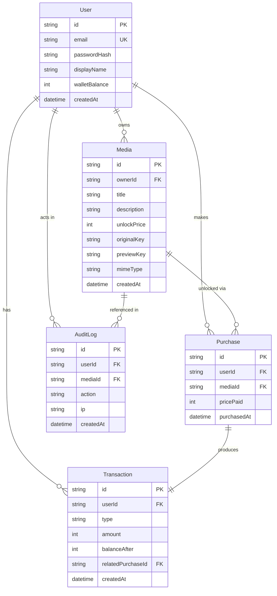

# Database Schema

PostgreSQL, managed via Prisma (`backend/prisma/schema.prisma`). Migration source of truth lives in `backend/prisma/migrations/`.

## Entity-Relationship Diagram

## Notes on design decisions

- **`Purchase` has a unique constraint on `(userId, mediaId)`.** This is the hard backstop against double-spending: even if two "unlock" requests for the same media race each other and both pass the application-level "do I already own this?" check, the second `INSERT` fails at the database level with a unique-violation, which the service layer catches and turns into a `409 Conflict`.
- **`originalKey` / `previewKey` are random UUIDs, not the uploaded filename.** The DB is the only place that maps a media row to its file on disk — you cannot infer or guess a storage path from the API.
- **`Transaction.relatedPurchaseId` is unique and optional.** `SEED` transactions (the starting wallet grant) have no related purchase; `DEBIT` transactions from an unlock always do.
- **`AuditLog.userId` / `mediaId` are nullable.** Some audit events (e.g., an unlock attempt against a media ID that doesn't exist) can't reference a real `Media` row, so those fields are optional rather than forcing a foreign key that would sometimes have nothing valid to point to.
- **Wallet balance is a column on `User`, not derived from summing transactions.** Simpler and fast to read; every mutation to it happens inside the same DB transaction that writes the corresponding `Transaction` row, so the two never drift apart.
